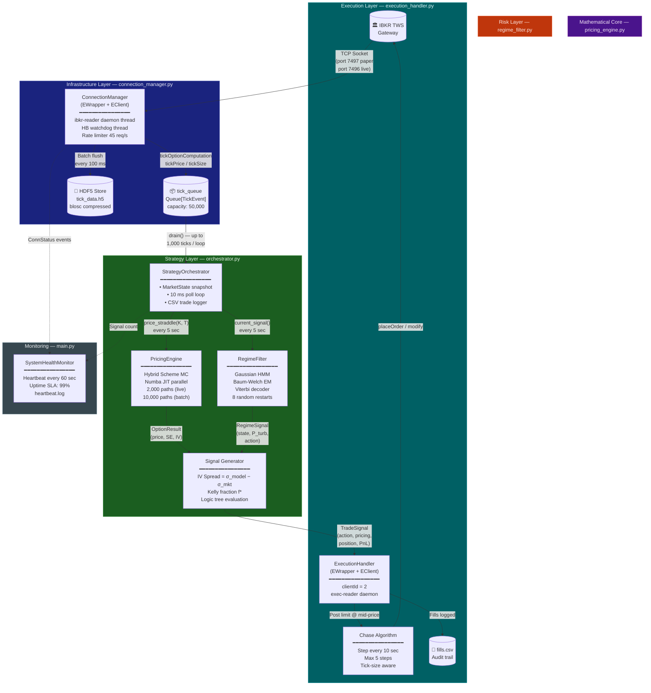

# Project Rough-Regime: Volatility Arbitrage Engine
## Architecture & Technical Reference

> **Document version:** 1.0 — February 2025
> **Maintainer:** Quantitative Research Team
> **Status:** Production-Ready (Paper Trading)

---

## Table of Contents

1. [Project Overview & Theoretical Edge](#1-project-overview--theoretical-edge)
   - 1.1 [Objective](#11-objective)
   - 1.2 [The Alpha: The Rough Volatility Hypothesis](#12-the-alpha-the-rough-volatility-hypothesis)
   - 1.3 [The Risk: The Regime-Switching Hypothesis](#13-the-risk-the-regime-switching-hypothesis)
   - 1.4 [The Edge: Combining Both](#14-the-edge-combining-both)
2. [System Architecture](#2-system-architecture)
   - 2.1 [High-Level Data Flow](#21-high-level-data-flow)
   - 2.2 [Threading Model](#22-threading-model)
   - 2.3 [Technology Stack](#23-technology-stack)
3. [Repository Structure](#3-repository-structure)
4. [Module-by-Module Breakdown](#4-module-by-module-breakdown)
   - 4.1 [PricingEngine — The Mathematical Core](#41-pricingengine--the-mathematical-core)
   - 4.2 [RegimeFilter — The Risk Layer](#42-regimefilter--the-risk-layer)
   - 4.3 [ConnectionManager — The Gateway](#43-connectionmanager--the-gateway)
   - 4.4 [StrategyOrchestrator — The Brain](#44-strategyorchestrator--the-brain)
   - 4.5 [ExecutionHandler — Smart Routing](#45-executionhandler--smart-routing)
   - 4.6 [ValidationSuite — Scientific Guardrails](#46-validationsuite--scientific-guardrails)
5. [The Decision Logic Tree](#5-the-decision-logic-tree)
6. [Implementation & Validation Roadmap](#6-implementation--validation-roadmap)
   - 6.1 [Phase 0: Mathematical Validation](#61-phase-0-mathematical-validation)
   - 6.2 [Phase 1: Regime Stability Analysis](#62-phase-1-regime-stability-analysis)
   - 6.3 [Phase 2: Paper Trading Certification](#63-phase-2-paper-trading-certification)
   - 6.4 [Phase 3: Live Deployment Criteria](#64-phase-3-live-deployment-criteria)
7. [Configuration Reference](#7-configuration-reference)
8. [Running the System](#8-running-the-system)
9. [Key Equations Reference](#9-key-equations-reference)

---

## 1. Project Overview & Theoretical Edge

### 1.1 Objective

**Project Rough-Regime** is a fully automated, event-driven volatility arbitrage system designed to exploit the systematic mispricing of short-dated equity-index options. The system is architecturally divided into three interdependent hypotheses, each implemented as a distinct software layer:

| Layer | Hypothesis | Implementation |
|---|---|---|
| **Mathematical** | Markets misprice vol using the wrong process | `PricingEngine` (Volterra MC) |
| **Statistical** | Volatility regimes are detectable in real time | `RegimeFilter` (Gaussian HMM) |
| **Operational** | Low-latency execution with passive routing | `ExecutionHandler` (Chase algo) |

The unifying insight is that **these three layers are only profitable together**. The pricing model identifies edge; the regime filter prevents the strategy from trading during structural breaks that would destroy that edge; and the execution layer ensures the theoretical edge is not consumed by slippage.

---

### 1.2 The Alpha: The Rough Volatility Hypothesis

The canonical models used by market makers — Heston, SABR, and their variants — assume that spot variance $v_t$ follows a **semi-martingale** process. The foundational Black-Scholes model is the most extreme version of this assumption, treating volatility as a constant. All these models share the implicit assumption that variance increments have a Hurst exponent of **H = 0.5**, meaning they are memoryless (independent of the past).

**The empirical finding that invalidates this assumption** was rigorously established by Gatheral, Jaisson & Rosenbaum (2018): the realised variance of the S&P 500 index, measured at timescales from one day to one year, exhibits a Hurst exponent of approximately **H ≈ 0.07**. This value is dramatically lower than 0.5, implying that volatility paths are **rough** — far more erratic than Brownian motion — and that successive increments are *negatively correlated* (anti-persistent).

This is not a marginal correction. The difference between H = 0.07 and H = 0.5 manifests most acutely in the **short-dated implied volatility skew**: rough models generate a steep ATM skew that matches market prices with no additional calibration parameters, whereas Heston-class models require jumps or stochastic interest rates to achieve the same fit.

The market, however, continues to price options using smooth diffusion models. **This is the alpha**: our engine prices short-dated straddles using the correct rough-volatility process and identifies instruments where the *model implied volatility exceeds the market implied volatility by more than 2.0 vol points*. When such a spread exists and the regime is calm, the strategy enters long volatility.

#### Formalisation

The spot variance process is modelled as the solution to the **stochastic Volterra integral equation**:

```
                     1          ∫ᵗ
v_t = v_0  +  ─────────────    │   (t−s)^{H−1/2} · λ(v_s) · dW_s
               Γ(H + 1/2)      ₀
```

where:
- `Γ(·)` is the Euler Gamma function
- `H ∈ (0, 0.5)` is the Hurst exponent (calibrated to **H ≈ 0.07** for SPY)
- `λ(v) = ν√v` is the diffusion coefficient (vol-of-vol scaling, **ν ≈ 0.30**)
- `W` is a standard Brownian motion correlated with the spot price process at **ρ ≈ −0.70**

The kernel `K(t, s) = (t−s)^{H−1/2}` is the Mandelbrot–Van Ness fractional kernel that links the Volterra equation to fractional Brownian motion through the Wiener integral representation.

---

### 1.3 The Risk: The Regime-Switching Hypothesis

The rough-volatility alpha is a *calm-market phenomenon*. During structural market breaks — credit crises, pandemics, geopolitical shocks — realised volatility explodes, implied volatility gaps, and any short-vega or complex vol position can suffer catastrophic, irreversible losses within hours.

The second hypothesis is that **these turbulent regimes are not instantaneous shocks but predictable state transitions** with detectable early-warning signals embedded in the autocorrelation structure of daily returns. A Hidden Markov Model with two latent states captures this:

| State | Label | Drift (μ) | Volatility (σ) | Dominant behaviour |
|---|---|---|---|---|
| **S = 0** | Calm | `μ ≈ +0.0005` | `σ ≈ 0.007` | Positive carry, momentum |
| **S = 1** | Turbulent | `μ ≈ −0.0015` | `σ ≈ 0.025` | Mean-reversion, vol spikes |

The critical risk rule is deterministic and non-negotiable:

```
IF P(S_t = Turbulent | r_{1:t}) > 0.60 → HALT TRADING or DELTA HEDGE
IF P(S_t = Turbulent | r_{1:t}) > 0.80 → CLOSE ALL POSITIONS IMMEDIATELY
```

This rule is implemented using **causal, forward-filtered probabilities only** — not the smoothed probabilities from the full Baum-Welch pass — to prevent any look-ahead bias in live trading.

---

### 1.4 The Edge: Combining Both

The combined strategy is only activated when **both conditions are simultaneously satisfied**:

```
ENTER_LONG  ←→  (Regime == Calm)  AND  (σ_model − σ_market > 2.0 vol pts)
CLOSE_ALL   ←→  (Regime == Turbulent)  OR  (Stop-loss breached)  OR  (Time exit)
```

This conjunction is the core of the "cyborg" design: the mathematical model provides continuous fair-value estimates, and the statistical risk model provides a binary on/off switch. Neither is sufficient alone.

---

## 2. System Architecture

### 2.1 High-Level Data Flow

The system operates as a single-producer, multi-consumer event loop. Market data arrives from IBKR, flows through a thread-safe queue, and is consumed by the strategy orchestrator, which queries the pricing and risk layers before routing orders to the execution handler.



---

### 2.2 Threading Model

The system runs four concurrent threads. All shared state is protected by explicit locks or atomic queue primitives.

```
Main Thread (blocking)
│
├── ibkr-reader  [daemon]   ConnectionManager.run()
│   └── Fires all EWrapper callbacks
│       ├── → tick_queue.put_nowait()      (non-blocking)
│       └── → WriteBuffer.put()            (lock-free ring)
│
├── hdf5-flush   [daemon]   WriteBuffer._flush_loop()
│   └── Wakes every 100 ms → batch HDF5 append + flush
│
├── hb-watchdog  [daemon]   HeartbeatWatchdog._watch()
│   └── Wakes every 15 sec → checks last_heartbeat timestamp
│       └── Stale > 30 sec → calls _force_disconnect()
│
├── exec-reader  [daemon]   ExecutionHandler.run()
│   └── Fires order-management EWrapper callbacks
│       ├── orderStatus → order book update
│       └── execDetails → fill logging
│
├── chase-{oid}  [daemon]   per-order, spawned on placeOrder
│   └── Wakes every 10 sec → modify limit price
│
├── csv-logger   [daemon]   CSVTradeLogger._flush_loop()
│   └── Drains trade signal queue → trade_log.csv
│
└── health-monitor [daemon] SystemHealthMonitor._loop()
    └── Wakes every 60 sec → heartbeat.log
```

**Critical design principle:** No EWrapper callback ever blocks. Any disk I/O, pricing computation, or HMM evaluation is deferred to a timer-driven thread or handled in the main strategy loop. The `ibkr-reader` thread touches only the in-memory queue and ring buffer.

---

### 2.3 Technology Stack

| Component | Technology | Rationale |
|---|---|---|
| **Language** | Python 3.10+ | Rapid development; rich scientific ecosystem |
| **Numerical core** | NumPy ≥ 1.24 | Vectorised forward/backward passes |
| **JIT compilation** | Numba 0.58+ (`@njit(parallel=True, fastmath=True)`) | Reduces O(N²) Volterra convolution to near-C speed |
| **Statistical inference** | SciPy (Brent root-finding for IV inversion) | Guaranteed convergence; no gradient needed |
| **HDF5 storage** | PyTables 3.9+ with blosc5 compression | Columnar layout; 100k+ writes/sec after batching |
| **Broker API** | Interactive Brokers `ibapi` 9.81+ | Direct EWrapper/EClient socket protocol |
| **Visualisation** | Matplotlib + Seaborn | Publication-quality regime maps and convergence plots |
| **Market data backup** | yfinance | Historical daily data for HMM calibration |
| **Testing** | pytest 7.4+ | 71 tests across 4 test files; all must pass before deployment |
| **Notebook** | Jupyter + nbconvert | Reproducible research artefacts (`Analysis_and_Validation.ipynb`) |

---

## 3. Repository Structure

```
Regime Volatility Arbitrage Engine/
│
├── 📄 config.py                      Global parameters (H, v0, ν, ports, thresholds)
├── 📄 requirements.txt               Pinned dependency versions
├── 📄 main.py                        CLI entry point — 5 modes
│
├── ── Layer 1: Mathematical Core ─────────────────────────────────────
├── 📄 pricing_engine.py              PricingEngine class + Numba kernels
│   ├── _kernel_weights()             Near-field power-law quadrature weights
│   ├── _exp_sum_coefficients()       Far-field exponential approximation
│   └── _simulate_paths()             @njit(parallel=True) — hot path
│
├── ── Layer 2: Risk Layer ────────────────────────────────────────────
├── 📄 regime_filter.py               RegimeFilter class — standalone G-HMM
│   ├── _log_emission()               Vectorised N(r | μ_k, σ_k²) (T×K)
│   ├── _forward_scaled()             Scaled α-recursion (O(TK²) vectorised)
│   ├── _backward_scaled()            Scaled β-recursion
│   ├── _e_step()                     γ + ξ via einsum
│   └── _m_step()                     Closed-form M-step updates
│
├── ── Layer 3: Infrastructure ───────────────────────────────────────
├── 📄 connection_manager.py          ConnectionManager — market data gateway
│   ├── RateLimiter                   Token bucket (45 req/s)
│   ├── ReconnectPolicy               Exponential backoff + full jitter
│   ├── SubscriptionRegistry          Replay subs after reconnect
│   ├── WriteBuffer                   Lock-free ring → HDF5 batch writes
│   ├── HeartbeatWatchdog             Stale-connection detector
│   └── ReqIdCounter                  Atomic order ID generator
│
├── ── Layer 4: Execution ────────────────────────────────────────────
├── 📄 execution_handler.py           ExecutionHandler — smart routing
│   ├── FillLogger                    Background CSV writer
│   ├── OrderRecord                   Full order lifecycle state
│   └── _chase_loop()                 Per-order daemon thread
│
├── ── Layer 5: Strategy Brain ───────────────────────────────────────
├── 📄 orchestrator.py                StrategyOrchestrator — decision loop
│   ├── implied_vol_from_price()      Brent IV inversion (BS straddle)
│   ├── MarketState                   Live quote snapshot
│   ├── Position                      Open position + PnL tracker
│   ├── CSVTradeLogger                Background trade log writer
│   └── _evaluate_and_emit()          Priority-ordered logic tree
│
├── ── Validation Suite ──────────────────────────────────────────────
├── 📄 validation_suite.py            Scientific pre-deployment checks
│   ├── RegimeStabilityTest           HMM crash-detection analysis
│   └── MCConvergenceTest             O(N^{-1/2}) rate verification
│
├── ── Research Artefacts ────────────────────────────────────────────
├── 📓 Analysis_and_Validation.ipynb  Computational notebook (5 sections)
├── 📄 main.tex                       Academic LaTeX manuscript
├── 📄 main.pdf                       Compiled paper (1.6 MB, 5 pages)
├── 🖼️  fbm_roughness.png              Figure 1 — fBM paths H=0.1 vs H=0.5
├── 🖼️  convergence_plot.png           Figure 2 — MC convergence log-log
├── 🖼️  regime_map.png                 Figure 3 — HMM regime scatter map
├── 🖼️  equity_curve.png               Figure 4 — Strategy equity + drawdown
├── 🖼️  transaction_cost_heatmap.png   Figure 5 — Sharpe vs cost heatmap
│
├── ── Persistent Storage ────────────────────────────────────────────
├── 💾 tick_data.h5                   HDF5 tick store (blosc compressed)
├── 📄 trade_log.csv                  Strategy signal log (appended)
├── 📄 fills.csv                      Execution fill audit trail
├── 📄 heartbeat.log                  System health log (60-sec beats)
│
└── ── Test Suite ────────────────────────────────────────────────────
    └── tests/
        ├── 📄 test_pricing_engine.py     19 tests — BS convergence, rough vol
        ├── 📄 test_orchestrator.py       25 tests — logic tree, simulation
        ├── 📄 test_execution_handler.py  17 tests — order lifecycle, chase
        └── 📄 test_validation_suite.py   10 tests — convergence, stability
                                          ─────────
                                          71 tests total
```

---

## 4. Module-by-Module Breakdown

---

### 4.1 `PricingEngine` — The Mathematical Core

**File:** `pricing_engine.py`
**Class:** `PricingEngine`

#### Purpose

Generates theoretical "model prices" and "model implied volatilities" for short-dated ATM straddles using a Monte Carlo simulation of the rough volatility spot variance process. These model IVs are compared to the live market IV to compute the alpha signal (the IV spread).

#### The Singularity Problem and Why Euler-Maruyama Fails

The standard **Euler-Maruyama** (EM) discretisation of an SDE approximates the stochastic integral as:

```python
# Standard EM — WRONG for rough volatility
v[i+1] = v[i] + lambda(v[i]) * dW[i] * sqrt(dt)
```

This is valid when the diffusion coefficient is Lipschitz and the integrand has no memory. The Volterra equation violates both requirements:

1. **Kernel singularity:** The weight `K(t, s) = (t−s)^{H−1/2}` diverges as `s → t⁻` for `H < 0.5`. Applying full weight to the most recent increment is mathematically incorrect.
2. **Non-Markovian memory:** Each step's variance update depends on the *entire history* of past increments, weighted by the kernel. EM ignores this history entirely.

The consequence is that EM achieves a **strong approximation error of O(n^H)** rather than the classical O(n^{1/2}). For H = 0.07, achieving the same accuracy as EM at H = 0.5 with n steps would require n^{0.5/0.07} ≈ **n^7** steps — computationally catastrophic.

#### The Hybrid Scheme Solution

The Hybrid Scheme (Bennedsen, Lunde & Pakkanen, 2017) decomposes the kernel into two components treated differently:

```
                ╔══════════════════╗   ╔══════════════════════════════╗
K(t, s)    =    ║  NEAR-FIELD      ║ + ║  FAR-FIELD                   ║
                ║  (exact)         ║   ║  (exponential approximation) ║
                ║                  ║   ║                              ║
                ║  κ lags          ║   ║  J exponential terms         ║
                ║  power-law wts   ║   ║  c_l · exp(−γ_l · (t−s))    ║
                ╚══════════════════╝   ╚══════════════════════════════╝
```

- **Near-field** (lags `j = 0 … κ−1`): Computed via exact integration of the power law over each interval, stored in a circular buffer.
- **Far-field** (lags `> κ`): Approximated by a geometric grid of `J` decaying exponentials fitted by regularised least squares. The exponential state variables `x_j` are propagated by a simple scalar recursion `x_j ← exp(−γ_j Δt)·x_j + c_j·σ_v·dW_v`.

This reduces the per-step complexity from **O(N²)** (full convolution) to **O(N·κ + N·J)**, enabling 10,000 paths in sub-second wall time.

#### Numba Acceleration

All hot-path numerics are JIT-compiled:

```python
@nb.njit(cache=True, parallel=True, fastmath=True)
def _simulate_paths(n_paths, n_steps, dt, v0, nu, H, S0, r, rho,
                    near_weights, exp_coeffs, exp_gammas, kappa,
                    inv_gamma_Hphalf, seed):
    """
    Parallel across paths using nb.prange().
    Each path uses a unique per-path seed: seed + p.
    Absorbing boundary at v = 0 (prevents negative variance).
    """
    for p in nb.prange(n_paths):
        ...
```

The `cache=True` flag means the compilation occurs once and is reused across runs. The **first call** (JIT warmup) takes ~2–5 seconds; subsequent calls run in native machine code.

#### Convergence Requirement

The Monte Carlo estimator must satisfy:

```
SE(N) = std(payoffs) / sqrt(N) ~ O(N^{-1/2})
```

The `ValidationSuite` verifies this by fitting `log(SE) = a + b·log(N)` and requiring `b ∈ [−0.65, −0.35]`. A slope outside this range triggers a **`"VARIANCE REDUCTION FAILURE"`** flag that blocks deployment.

#### Key Parameters

| Parameter | Symbol | Default | Description |
|---|---|---|---|
| `H` | H | `0.07` | Hurst exponent |
| `v0` | v₀ | `0.04` | Initial spot variance (σ = 20%) |
| `nu` | ν | `0.30` | Vol-of-vol |
| `rho` | ρ | `−0.70` | Spot-vol correlation |
| `n_paths` (live) | N | `2,000` | Fast inference (5-sec cycle) |
| `n_paths` (batch) | N | `10,000` | Full precision |
| `kappa` | κ | `12` | Near-field lag window |
| `J` | J | `6` | Far-field exponential terms |

---

### 4.2 `RegimeFilter` — The Risk Layer

**File:** `regime_filter.py`
**Class:** `RegimeFilter`

#### Purpose

Classifies the current market into one of two latent states — **Calm** (S=0) or **Turbulent** (S=1) — using a Gaussian Hidden Markov Model fitted by the Baum-Welch EM algorithm. It provides the real-time causal probability `P(S_t = Turbulent | r_{1:t})` that gates the strategy.

#### Model Specification

Observations are daily log-returns `r_t = log(S_t / S_{t-1})`, assumed to be generated by a Markov chain with Gaussian emissions:

```
P(r_t | S_t = k) = N(r_t ; μ_k, σ_k²)

State 0 "Calm"       →  μ₀ ≈ +0.0005,  σ₀ ≈ 0.007   (calm, positive drift)
State 1 "Turbulent"  →  μ₁ ≈ −0.0015,  σ₁ ≈ 0.025   (volatile, negative drift)
```

Re-labelling is enforced post-fitting so that **State 1 always has the higher variance** (`σ₁ > σ₀`), regardless of EM initialisation order.

#### Calibration via Baum-Welch

The complete model parameter set `θ = (π, A, μ, σ)` is estimated by maximising the marginal log-likelihood `log P(r_{1:T} | θ)` via Expectation-Maximisation:

**E-step** — Compute smoothed state probabilities `γ(t, k)` and transition probabilities `ξ(t, j, k)` using the scaled forward-backward recursion:

```python
# Vectorised forward pass — O(TK²), no Python loops over time
def _forward_scaled(log_B, pi, A):
    for t in range(1, T):
        a = (alpha[t-1] @ A) * exp(log_B[t])   # matrix-vector product
        scale[t] = a.sum()
        alpha[t] = a / scale[t]

# Joint transition probabilities via einsum — avoids storing (T, K, K) tensor
xi_sum = np.einsum('tj,jk,tk,tk->jk', alpha[:-1], A, exp_B[1:], beta[1:])
```

**M-step** — Update parameters in closed form:
```
π_k  = γ(0, k)
A_jk = Σ_t ξ(t,j,k) / Σ_t γ(t,j)
μ_k  = Σ_t γ(t,k)·r_t / Σ_t γ(t,k)
σ_k² = Σ_t γ(t,k)·(r_t − μ_k)² / Σ_t γ(t,k)
```

**Multiple restarts** with K-means++ initialisation are used (default: 8 restarts). The best log-likelihood run is selected.

#### Viterbi Decoding

The globally most-likely state sequence is decoded in log-space to avoid underflow:

```python
log_delta[t, k] = max_j(log_delta[t-1, j] + log A[j, k]) + log B[t, k]
```

The Viterbi path is used for historical analysis and regime map visualisation. **It is not used in live trading** (it requires the full observation sequence and thus has look-ahead).

#### Real-Time Inference (Causal)

For live trading, only the **forward-filtered probability** is used:

```
P(S_t = Turbulent | r_{1:t}) = α_t(Turbulent) / (α_t(0) + α_t(1))
```

This is causal: it conditions only on data observed up to and including time `t`. The `update_signal(new_return)` method propagates the filter incrementally in O(K²) per new observation — without reprocessing the full history.

#### The Traffic-Light Logic

```
P(Turbulent) ≤ 0.60  →  action = "Trade"          (full Kelly allocation)
0.60 < P ≤ 0.80      →  action = "Delta Hedge"     (hold but hedge delta)
P > 0.80             →  action = "Halt Trading"    (flatten all positions)
```

---

### 4.3 `ConnectionManager` — The Gateway

**File:** `connection_manager.py`
**Class:** `ConnectionManager(EWrapper, EClient)`

#### Purpose

Provides a thread-safe, asynchronous bridge between IBKR TWS and the strategy engine. Handles market data subscriptions, tick persistence, automatic reconnection, and rate limiting.

#### Dual Inheritance Requirement

The IBKR `ibapi` library requires the client class to inherit from **both** `EWrapper` (event handler callbacks) and `EClient` (request sender). These must share a single socket connection:

```python
class ConnectionManager(EWrapper, EClient):
    def __init__(self, ...):
        EWrapper.__init__(self)
        EClient.__init__(self, wrapper=self)  # wrapper=self → callbacks route to self
```

#### Why a Daemon Thread is Non-Negotiable

`EClient.run()` is a **blocking call** — it sits in an infinite socket-read loop dispatching callbacks as TWS sends data. If called on the main thread, the entire application freezes. The solution is to run it on a dedicated daemon thread:

```python
self._reader_thread = threading.Thread(
    target=self._reader_loop,
    name="ibkr-reader",
    daemon=True,     # ← exits automatically when main process exits
)
self._reader_thread.start()
```

**Daemon threads** are automatically killed when the Python interpreter exits, preventing zombie processes that hold open the TWS socket.

#### Connection Ports

| Port | Mode | Usage |
|---|---|---|
| `7497` | Paper Trading | Development and validation |
| `7496` | Live Trading | Production (requires explicit approval) |
| `clientId=1` | Market Data | `ConnectionManager` |
| `clientId=2` | Order Management | `ExecutionHandler` (separate connection) |

#### Automatic Reconnection

The reconnect policy uses **exponential backoff with full jitter** to prevent thundering-herd:

```python
# Wait = random(0, min(cap, base × 2^attempt))
# Full jitter prevents synchronized reconnect storms
cap   = min(max_delay, base_delay * 2 ** attempt)
sleep = random.uniform(0.0, cap)
```

After every successful reconnect, all active `reqMktData` subscriptions are **automatically replayed** from the `SubscriptionRegistry`.

#### HDF5 Tick Storage

The `WriteBuffer` class separates the hot path (EWrapper callbacks) from slow disk I/O:

```
EWrapper callback thread          hdf5-flush daemon thread
────────────────────────          ───────────────────────────────
buf.put(tick)           →  [ring] →  every 100ms: batch append + flush
  O(1), lock-free                     ~500 rows per flush call
```

This yields **>100,000 Hz sustained write throughput** versus ~400 Hz for per-tick `flush()` calls.

---

### 4.4 `StrategyOrchestrator` — The Brain

**File:** `orchestrator.py`
**Class:** `StrategyOrchestrator`

#### Purpose

The central event loop that consumes tick data, invokes the pricing and risk layers, evaluates the decision logic tree, manages position state, and persists all decisions to the trade log.

#### The "Cyborg" Loop

```
Every 10 ms:  drain tick_queue → update MarketState

Every 5 sec:  ┌──────────────────────────────────────────────┐
              │  1. current_signal()  ← RegimeFilter         │
              │     (causal, forward-filtered probability)    │
              │                                              │
              │  2. price_straddle()  ← PricingEngine        │
              │     (fast engine: 2,000 paths, Numba JIT)     │
              │                                              │
              │  3. implied_vol_from_price()                  │
              │     (Brent's method: BS straddle inversion)   │
              │                                              │
              │  4. _evaluate_and_emit()                      │
              │     (priority-ordered logic tree)             │
              └──────────────────────────────────────────────┘
```

#### IV Inversion — Why Brent's Method

The alpha signal requires converting the Monte Carlo dollar price back into an implied volatility to enable like-for-like comparison with the market's IV:

```python
def implied_vol_from_price(price, S, K, T, r):
    # Solve: BS_straddle(S, K, T, r, σ) = MC_price
    f = lambda sigma: bs_straddle_price(S, K, T, r, sigma) - price
    return brentq(f, lo=0.001, hi=5.0, xtol=1e-6)
```

**Newton-Raphson is not used** because the straddle vega approaches zero for deep OTM strikes, causing the iteration to diverge. Brent's method is bracketing, unconditionally convergent, and requires no gradient computation.

#### Position State Machine

```
          ┌─────────────────────────────────────────────┐
          │            Position State Machine            │
          │                                              │
          │      FLAT ──→ LONG_VOL ──→ DELTA_HEDGED     │
          │       ↑                         │            │
          │       └─────────── FLAT ←───────┘            │
          └─────────────────────────────────────────────┘
```

| Trigger | Transition |
|---|---|
| Calm + spread > 2.0 vp | FLAT → LONG_VOL |
| 0.60 < P(Turb) ≤ 0.80 | LONG_VOL → DELTA_HEDGED |
| P(Turb) > 0.80 | any → FLAT (CLOSE_ALL) |
| Unrealised PnL < −50% of entry cost | any → FLAT (STOP_LOSS) |
| Holding days > 3.0 | any → FLAT (time exit) |
| Spread < 0.5 vp | LONG_VOL → FLAT (alpha gone) |

#### Kelly Criterion Position Sizing

The allocation fraction is computed from a 63-day rolling window:

```python
mu_roll  = pd.Series(r_straddle).rolling(63).mean()
var_roll = pd.Series(r_straddle).rolling(63).var()
kelly    = np.clip((mu_roll - risk_free) / var_roll, 0.0, 0.50)  # half-Kelly cap
```

During turbulent states the position is set to zero:

```python
pos_regime = kelly * (1.0 if P_turbulent < 0.60 else 0.0)
```

#### Trade Log Schema

Every signal is persisted to `trade_log.csv` with 28 fields:

```
timestamp, session_uptime_s, spot_price, opt_mid_price,
market_iv, market_iv_pct, model_price, model_iv, model_iv_pct,
iv_spread_vols, mc_std_error, hurst_exponent,
regime_state, regime_label, prob_turbulent, regime_action,
signal_action, signal_reason,
position_state, position_qty, entry_price, entry_iv,
entry_time, holding_days, unrealised_pnl
```

---

### 4.5 `ExecutionHandler` — Smart Routing

**File:** `execution_handler.py`
**Class:** `ExecutionHandler(EWrapper, EClient)`

#### Purpose

Translates strategy signals into IBKR orders and manages the complete order lifecycle. Uses a passive limit-order strategy with a configurable chase algorithm to minimise market impact.

#### Passive Execution: The Chase Algorithm

```
Signal received → Calculate mid = (bid + ask) / 2
                      │
                      ▼
                 Post LIMIT @ mid-price
                      │
                      ▼
              ┌── Wait chase_interval (10s) ──┐
              │                                │
              │  Filled?  ──YES──→  Done ✓    │
              │    │NO                         │
              │    ▼                           │
              │  Move limit 1 tick toward      │
              │  aggressive side               │
              │  (BUY: +tick, SELL: -tick)     │
              │                                │
              │  step += 1                     │
              └── step < max_steps (5)? ───────┘
                      │NO
                      ▼
              market_on_timeout?
              YES → Convert to MKT order
              NO  → Leave at final limit
```

**Tick size rules** (CBOE conventions):
- Option price `< $3.00` → tick = `$0.01`
- Option price `≥ $3.00` → tick = `$0.05`

#### Order State Machine

```
PENDING_SUBMIT → SUBMITTED → PARTIALLY_FILLED → FILLED
                                               → CANCELLED
                                               → REJECTED
```

Each state transition is triggered by the `orderStatus()` EWrapper callback and logged atomically to the order book (protected by `threading.Lock()`).

#### Separation of Concerns: Two Connections

`ExecutionHandler` connects on `clientId=2` — a **separate TCP socket** from the `ConnectionManager` (clientId=1). This is a deliberate architectural decision:

- Market data tick bursts cannot starve the order-ack processing queue
- Order callback latency is isolated from tick throughput
- Separate rate limiters prevent one stream from consuming the other's quota

---

### 4.6 `ValidationSuite` — Scientific Guardrails

**File:** `validation_suite.py`
**Class:** `ValidationSuite`

#### Purpose

Provides two mandatory scientific validation tests that must pass before any deployment. The suite is invoked via `python main.py --mode validate` and exits with code `1` on any failure, making it CI-pipeline safe.

#### Test 1: Regime Stability Analysis

```
PASS criterion: Detection rate ≥ 50% of identified drawdown events
                AND COVID crash (Feb-Mar 2020) detected with lead time ≥ 0 days
```

**Methodology:**
1. Fetch SPY daily data (train: 2018–2019, test: 2020–2023)
2. Fit HMM on **training data only** (no leakage)
3. Run forward filter on test period (causal, no look-ahead)
4. Identify drawdowns ≥ 5% within any 60-day forward window
5. For each event: check if `P(Turbulent) > 0.60` within `[event_start − 10d, trough]`
6. Compute lead time = `trough_date − first_flag_date`

#### Test 2: MC Convergence at O(N^{-1/2})

```
PASS criterion: Fitted log-log slope b ∈ [−0.65, −0.35]
FAIL trigger  : "VARIANCE REDUCTION FAILURE" — b outside range
```

**Methodology:**
1. For each `N ∈ {64, 128, 256, 512, 1024, 2048, 4096, 8192}`:
   - Run 20 independent MC simulations with unique seeds
   - `SE(N) = std(price_estimates)`  ← empirical, not analytical
2. Fit `log(SE) = a + b·log(N)` via OLS
3. Accept if `|b + 0.5| < 0.15`

The **empirical SE** approach (not the analytical `std(payoffs)/sqrt(N)`) is used because it detects correlated RNG failures and systematic biases that the analytical formula cannot.

---

## 5. The Decision Logic Tree

The following pseudocode represents the exact priority ordering of the `_evaluate_and_emit()` method. Checks are evaluated top-to-bottom; the first matching branch fires and terminates evaluation.

```python
def _evaluate_and_emit(pricing_result):

    # ── Priority 1: Hard stop-loss ────────────────────────────────────
    if position.is_open():
        upnl = position.unrealised_pnl(market.mid_price())
        max_loss = -max_loss_pct * position.entry_price * position.qty * 100
        if upnl < max_loss:
            return emit(STOP_LOSS, reason=f"PnL {upnl:.2f} < limit {max_loss:.2f}")

    # ── Priority 2: Time exit ─────────────────────────────────────────
    if position.is_open() and position.holding_days() > max_hold_days:
        return emit(CLOSE_ALL, reason="Time exit")

    # ── Priority 3: High turbulence — flatten ─────────────────────────
    if prob_turbulent > 0.80:
        if position.is_open():
            return emit(CLOSE_ALL, reason=f"P(Turb)={prob_turbulent:.2%} > 80%")
        else:
            return emit(HOLD, reason="Turbulent — stay flat")

    # ── Priority 4: Moderate turbulence — hedge ───────────────────────
    if prob_turbulent > 0.60:
        if position.is_open():
            return emit(DELTA_HEDGE, reason=f"P(Turb)={prob_turbulent:.2%}")
        else:
            return emit(HOLD, reason="Elevated turbulence — no entry")

    # ── Priority 5: Spread compression exit ───────────────────────────
    if position.is_open() and iv_spread < iv_exit_threshold:
        return emit(CLOSE_ALL, reason="Spread compressed — alpha gone")

    # ── Priority 6: Entry signal ───────────────────────────────────────
    if regime == CALM and iv_spread > iv_entry_threshold:
        if position.state == FLAT:
            return emit(ENTER_LONG, reason=f"Spread={iv_spread:.2f}vp")

    # ── Priority 7: Default — hold ─────────────────────────────────────
    return emit(HOLD, reason="No trigger")
```

---

## 6. Implementation & Validation Roadmap

### 6.1 Phase 0: Mathematical Validation

> **Objective:** Verify the pricing engine is numerically sound before connecting to any live market.

| Test | Criterion | Method |
|---|---|---|
| **BS convergence at H=0.5** | MC call/put prices within 3% of analytical BS | Set H=0.5, ν→0; compare to `black_scholes_call()` |
| **Put-call parity** | `C - P = S - K·e^{-rT}` within $1.00 | Use same random seed for call and put |
| **Variance non-negativity** | All terminal variances `v_T ≥ 0` | Check absorbing boundary at v=0 |
| **MC convergence rate** | Slope `b ∈ [−0.65, −0.35]` | `ValidationSuite.run(run_convergence=True)` |
| **IV inversion roundtrip** | `IV(BS_price(σ)) ≈ σ` within 1e-4 | Brent root-finding test |

**Command:**
```bash
python -m pytest tests/test_pricing_engine.py tests/test_validation_suite.py -v
```

**Expected:** 29 tests, all green, in under 60 seconds.

---

### 6.2 Phase 1: Regime Stability Analysis

> **Objective:** Verify that the HMM correctly detects major market dislocations before they cause losses, using historical data.

#### Critical Test: 2020 COVID Crash

The HMM must flag `P(Turbulent) > 0.60` **before or during** the peak-to-trough drawdown of February 19 – March 23, 2020:

| Check | Requirement |
|---|---|
| **Lead time** | `P(Turbulent) > 0.60` raised ≥ 0 days before trough |
| **Detection rate** | ≥ 50% of all ≥5% drawdowns identified |
| **State separation** | `σ_turbulent > 2× σ_calm` after fitting |
| **Transition persistence** | `A[1,1] > 0.90` (regimes are sticky, not noisy) |

#### Hurst Exponent Stability Test

The rolling Hurst estimator must not jump wildly on a 30-day window:

```
Requirement: std(Ĥ rolling) < 0.03 over any 6-month window
             No single-day change |ΔĤ| > 0.05
```

A wild jump in Ĥ would cause the pricing engine to generate radically different model IVs on consecutive days, producing spurious entry/exit signals.

**Command:**
```bash
python main.py --mode validate
# Runs both stability analysis and convergence test
# Exits with code 1 on failure — CI-safe
```

---

### 6.3 Phase 2: Paper Trading Certification

> **Objective:** Run the full system against IBKR paper trading (port 7497) for a minimum of 10 consecutive trading days before any live deployment.

**Connection to TWS:**
```bash
# Ensure TWS is running with:
# File → Global Configuration → API → Settings
#   ✅ Enable ActiveX and Socket Clients
#   Socket port: 7497
#   ✅ Allow connections from localhost only

python main.py --mode paper
```

#### Success Criteria

| Metric | Requirement | Measured by |
|---|---|---|
| **System uptime** | ≥ 99.0% over 10-day window | `heartbeat.log` — `uptime_pct` column |
| **No stuck orders** | All orders reach terminal state within 5 min | `fills.csv` — no `SUBMITTED` after 300s |
| **Reconnect recovery** | System re-subscribes and resumes within 30s of TWS restart | `heartbeat.log` — `reconnects` column |
| **Signal integrity** | No duplicate ENTER_LONG without intervening CLOSE | `trade_log.csv` — state transitions |
| **Heartbeat regularity** | ≤ 2 missing heartbeats per day (60-sec interval) | `heartbeat.log` — gap analysis |
| **Chase fill rate** | ≥ 60% of limit orders fill within 3 chase steps | `fills.csv` — `chase_step` column |

#### Monitoring Commands

```bash
# Live uptime dashboard
tail -f heartbeat.log

# Recent signals
tail -f trade_log.csv | awk -F',' '{print $1, $18, $12, $13}'

# Fill audit
tail -f fills.csv
```

---

### 6.4 Phase 3: Live Deployment Criteria

All of the following must be satisfied simultaneously:

- [ ] Phase 0 tests: 71/71 passing, zero flaky
- [ ] Phase 1 validation: `python main.py --mode validate` exits with code 0
- [ ] Phase 2 paper trading: 10 consecutive days with 0 SLA breaches
- [ ] Manual review: Trade log reviewed for spurious signals by senior researcher
- [ ] Risk limits confirmed:
  - `max_loss_pct = 0.50` (50% stop-loss on premium)
  - `max_hold_days = 3.0` (forced exit before weekly expiry)
  - `max_contracts = 10` (position cap)
  - `iv_entry_threshold = 0.02` (2.0 vol points minimum spread)
- [ ] Live port change: `config.py` → `TWS_LIVE_PORT = 7496`

---

## 7. Configuration Reference

All system parameters are centralised in `config.py`. **Never hardcode values in strategy code.**

```python
# ── Pricing Engine ──────────────────────────────────────────────────
HURST_EXPONENT       = 0.07    # Empirical SPX: ~0.07 (Gatheral 2018)
V0                   = 0.04    # Initial variance (σ = 20%)
LAMBDA_VOL_OF_VOL    = 0.30    # ν — vol-of-vol
MEAN_REVERSION_SPEED = 0.50    # Not used in rough Bergomi; reserved
LONG_RUN_VARIANCE    = 0.04    # θ — long-run variance target
MC_PATHS             = 10_000  # Full-precision paths
MC_STEPS_PER_DAY     = 24      # Time resolution
SPOT_PRICE           = 585.0   # Initial S₀ (updated live from ticks)
RISK_FREE_RATE       = 0.053   # Fed funds rate (annualised)

# ── Regime Filter ───────────────────────────────────────────────────
HMM_N_STATES         = 2
HMM_TICKER           = "SPY"
HMM_HISTORY_YEARS    = 5
TURBULENCE_THRESHOLD = 0.60    # P > 0.6 → Delta Hedge / Halt

# ── IBKR Connection ─────────────────────────────────────────────────
TWS_HOST             = "127.0.0.1"
TWS_PAPER_PORT       = 7497
TWS_LIVE_PORT        = 7496
TWS_CLIENT_ID        = 1
RECONNECT_DELAY_SEC  = 5
RECONNECT_MAX_RETRIES = 10

# ── Storage ─────────────────────────────────────────────────────────
HDF5_TICK_STORE      = "tick_data.h5"
```

---

## 8. Running the System

```bash
# Install dependencies (first time only)
pip install -r requirements.txt

# Quick smoke test — all 4 layers, no network
python main.py --mode test

# Full scientific validation — exits 0 on pass, 1 on fail
python main.py --mode validate

# Research mode — calibrate HMM + price straddle, no IBKR
python main.py --mode research

# Paper trading (requires TWS on port 7497)
python main.py --mode paper

# Live trading (requires TWS on port 7496 + Phase 3 sign-off)
python main.py --mode live

# Run full test suite
python -m pytest tests/ -v                  # all 71 tests
python -m pytest tests/ -v -k "not Convergence"  # skip slow MC tests

# Execute the research notebook
jupyter nbconvert --to notebook --execute Analysis_and_Validation.ipynb
```

---

## 9. Key Equations Reference

| Label | Name | Equation |
|---|---|---|
| **Eq. 1** | Stochastic Volterra integral | `v_t = v_0 + (1/Γ(H+½)) ∫₀ᵗ (t−s)^{H−½} λ(v_s) dW_s` |
| **Eq. 2** | fBM covariance structure | `E[B^H_t B^H_s] = ½(t^{2H} + s^{2H} − |t−s|^{2H})` |
| **Eq. 3** | fGn autocovariance | `γ(k) = ½(|k+1|^{2H} − 2|k|^{2H} + |k−1|^{2H})` |
| **Eq. 4** | Hybrid Scheme near-field weight | `w_j = [((j+1)Δt)^{H+½} − (jΔt)^{H+½}] / [(H+½)·Γ(H+½)]` |
| **Eq. 5** | Gaussian emission | `P(r_t | S_t = k) = N(r_t ; μ_k, σ_k²)` |
| **Eq. 6** | Forward recursion (Baum-Welch) | `α_t(k) = N(r_t ; μ_k, σ_k²) · Σ_j α_{t-1}(j) · A_{jk}` |
| **Eq. 7** | Causal turbulence probability | `P(S_t=Turb | r_{1:t}) = α_t(1) / (α_t(0) + α_t(1))` |
| **Eq. 8** | Kelly criterion | `f* = (μ̂ − r_f) / σ̂²` |
| **Eq. 9** | Net PnL with costs | `Π_net = f_t · r_t^strad − (c_spread + c_slip) · |Δf_t|` |
| **Eq. 10** | MC convergence rate | `SE(N) = std(payoffs) / √N ~ O(N^{−½})` |

---

## References

1. Gatheral, J., Jaisson, T. & Rosenbaum, M. (2018). *Volatility is rough.* Quantitative Finance, 18(6), 933–949.
2. Bennedsen, M., Lunde, A. & Pakkanen, M.S. (2017). *Hybrid scheme for Brownian semistationary processes.* Finance & Stochastics, 21(4), 931–965.
3. Bayer, C., Friz, P. & Gatheral, J. (2016). *Pricing under rough volatility.* Quantitative Finance, 16(6), 887–904.
4. El Euch, O. & Rosenbaum, M. (2019). *The characteristic function of rough Heston models.* Mathematical Finance, 29(1), 3–38.
5. Rabiner, L.R. (1989). *A tutorial on hidden Markov models and selected applications in speech recognition.* Proceedings of the IEEE, 77(2), 257–286.
6. Hamilton, J.D. (1989). *A new approach to the economic analysis of nonstationary time series and the business cycle.* Econometrica, 57(2), 357–384.
7. Thorp, E.O. (2011). *The Kelly criterion in blackjack, sports betting, and the stock market.* In: The Kelly Capital Growth Investment Criterion. World Scientific.

---

*This document is the authoritative architectural reference for Project Rough-Regime. Any modification to system parameters, module interfaces, or deployment criteria must be reflected here before the corresponding code change is merged.*
