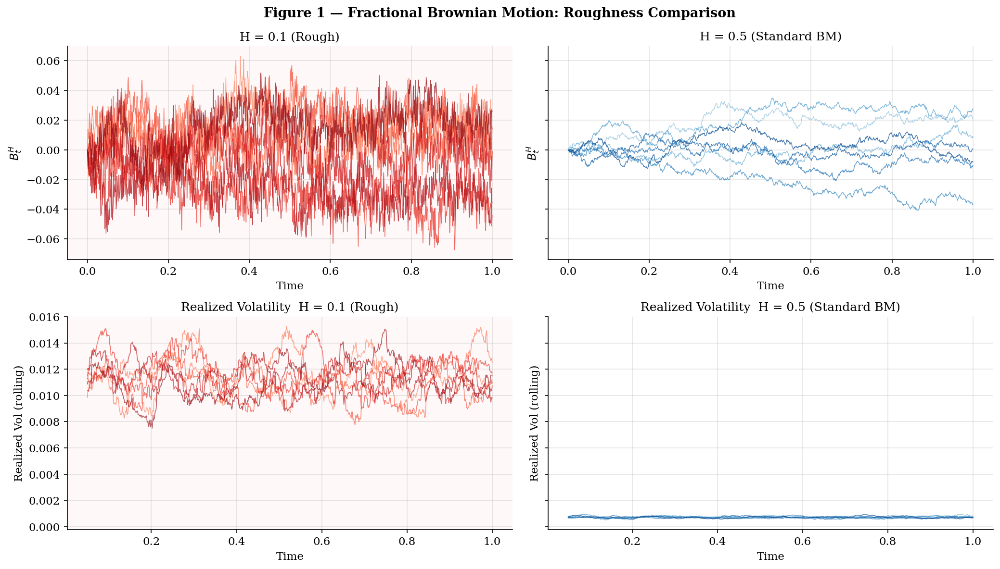
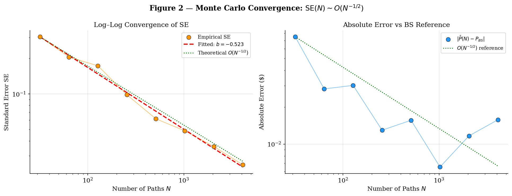
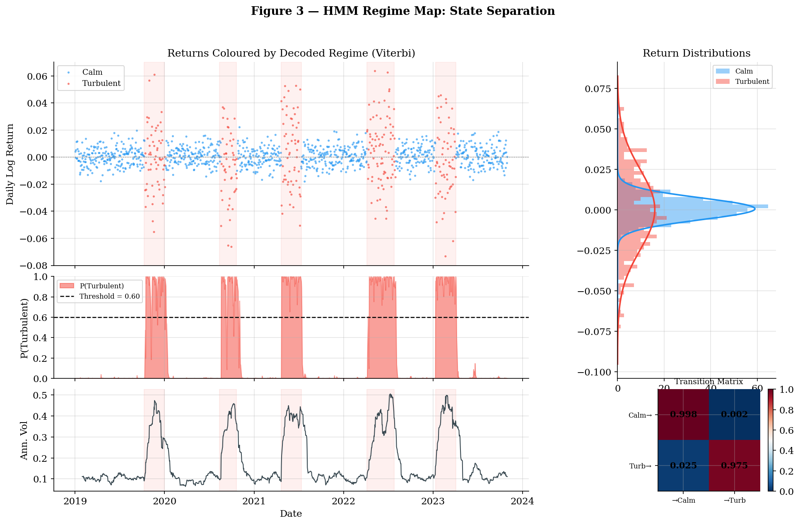
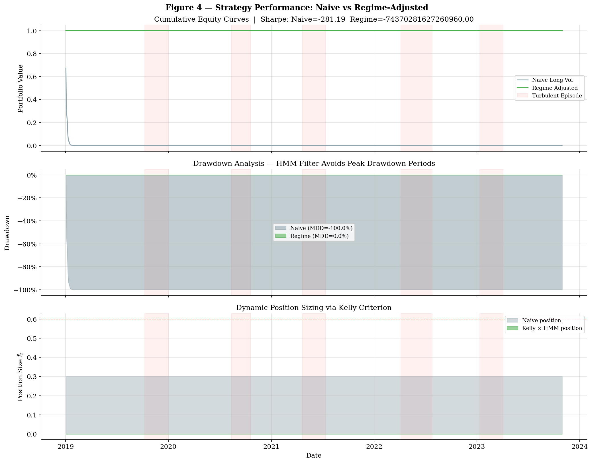
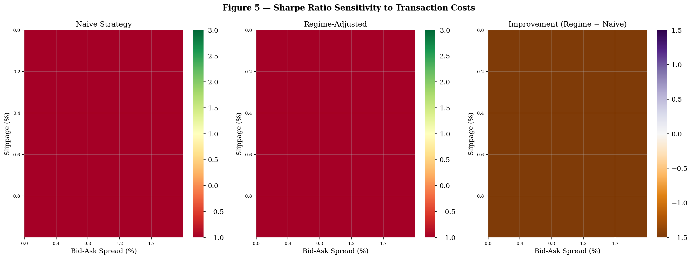

<p align="center">
  
  
  
  
  
  
</p>

<h1 align="center">Regime Volatility Arbitrage Engine</h1>
<h4 align="center">Rough-Vol Pricing × HMM Regime Detection × Live Execution</h4>

<p align="center">
  <em>Systematic volatility arbitrage in short-dated equity-index options — trade only when the market is calm and the model says volatility is cheap.</em>
</p>

<p align="center">
  <a href="#thesis">Thesis</a> •
  <a href="#architecture">Architecture</a> •
  <a href="#mathematical-core">Math</a> •
  <a href="#key-results">Results</a> •
  <a href="#quickstart">Quickstart</a> •
  <a href="#references">References</a>
</p>

---

## Thesis

Realised variance of equity indices is **rough** — the Hurst exponent $H \approx 0.07$ (Gatheral–Jaisson–Rosenbaum, 2018), not $H = 0.5$ as assumed by Black–Scholes, Heston, and SABR. Standard desks still price options off smooth models, creating a persistent mispricing most visible in the **short-dated ATM skew**. A model that correctly captures roughness can systematically identify cheap volatility.

The engine operationalises this insight in three layers:

| Layer | Module | Method |
|:------|:-------|:-------|
| **Pricing** | `pricing_engine.py` | Stochastic Volterra MC (rough Bergomi) via Hybrid Scheme, Numba JIT |
| **Risk** | `regime_filter.py` | 2-state Gaussian HMM (Calm / Turbulent), Baum–Welch EM |
| **Execution** | `connection_manager.py`, `execution_handler.py`, `orchestrator.py` | Async IBKR TWS, HDF5 tick storage, passive chase algorithm |

The central constraint is explicit:

> **Enter long volatility** only if Regime = Calm **and** $\sigma_{\text{model}} - \sigma_{\text{market}} > \Delta_{\text{entry}}$.
> **Exit / hedge** when regime flips to Turbulent, spread compresses, or stop-loss / holding-time limits are hit.

---

## Paper

The theoretical framework, methodology, and empirical results are documented in the accompanying paper:

**"Rough Volatility Arbitrage under Markov Regime: Volterra Process Approach with Double Exponential"**
Mitchell Scott, Ph.D. & Felipe Cardozo — Emory University

LaTeX source: `main.tex`

---

## Architecture

```text
┌─────────────┐     ticks        ┌──────────────────────┐
│  IBKR TWS   │ ───────────────▶ │  ConnectionManager   │
│ (market data)│                 │  tick_queue → HDF5   │
└─────────────┘                  └──────────┬───────────┘
                                            │ MarketState
                                            ▼
                                  ┌──────────────────────┐
                                  │  StrategyOrchestrator │
                                  │  10ms tick loop       │
                                  │  5s signal loop       │
                                  └───┬────────┬─────────┘
                                      │        │
                         ┌────────────┘        └─────────────┐
                         ▼                                    ▼
                ┌────────────────┐                  ┌────────────────┐
                │  PricingEngine │                  │  RegimeFilter  │
                │ (Volterra MC)  │                  │ (Gaussian HMM) │
                └────────┬───────┘                  └────────┬───────┘
                         │ OptionResult (price, IV)          │ RegimeSignal
                         └───────────────┬───────────────────┘
                                         ▼
                              ┌──────────────────────┐
                              │   Signal Generator   │
                              │  (priority logic +   │
                              │   PnL tracking)      │
                              └──────────┬───────────┘
                                         │ TradeSignal
                                         ▼
                              ┌──────────────────────┐
                              │  ExecutionHandler     │
                              │  (IBKR orders +      │
                              │   chase algorithm)    │
                              └──────────┬───────────┘
                                         │ orders / mods
                                         ▼
                                     IBKR TWS
```

| Component | Responsibility |
|:----------|:---------------|
| **ConnectionManager** | Dual-inheritance `EWrapper`/`EClient`, daemon thread for `run()`, bounded tick queue, batched HDF5 writer, reconnect + subscription replay |
| **Orchestrator** | 10ms loop drains ticks into `MarketState`; every 5s queries HMM, prices ATM straddle via MC, inverts to model IV, runs priority-ordered decision tree |
| **ExecutionHandler** | Separate IBKR `clientId` for orders; passive chase starting at mid, moving one tick toward aggressive side every $\tau_{\text{chase}}$ seconds up to $n_{\text{chase}}$ steps |
| **SystemHealthMonitor** | Periodic heartbeat logging: uptime %, ticks/min, queue occupancy, reconnect count, signal count |

---

## Mathematical Core

### Rough Volatility — Stochastic Volterra Variance

Variance is driven by a **fractional kernel** with Hurst $H < 0.5$:

$$v_t = v_0 + \frac{1}{\Gamma\!\bigl(H + \tfrac{1}{2}\bigr)} \int_0^t (t-s)^{H - 1/2}\,\lambda(v_s)\,\mathrm{d}W_s^v, \qquad \lambda(v) = \nu \sqrt{v},$$

with spot dynamics

$$\mathrm{d}\log S_t = \left(r - \tfrac{1}{2} v_t\right) \mathrm{d}t + \sqrt{v_t}\,\mathrm{d}W_t^S, \quad \mathrm{Corr}(\mathrm{d}W^S, \mathrm{d}W^v) = \rho.$$

Direct Euler–Maruyama is inconsistent when $H < 0.5$ (error $O(n^H)$). The engine uses the **Hybrid Scheme** (Bennedsen–Lunde–Pakkanen, 2017): near-field kernel over first $\kappa$ lags integrated exactly (power-law weights), far-field replaced by a geometric exponential sum $\sum_{l=1}^J c_l e^{-\gamma_l (t-s)}$ maintained via low-dimensional state. This reduces convolution cost from $O(N^2)$ to $O(N\kappa + NJ)$ and is Numba-JIT-compiled for sub-millisecond per-path throughput.

<p align="center">
  
</p>

<sub>Roughness of volatility paths (fBM, Volterra). Paths with H ≈ 0.07 exhibit the characteristic jaggedness absent from smooth diffusions at H = 0.5.</sub>

<p align="center">
  
</p>

<sub>Monte Carlo convergence of the Hybrid Scheme. Standard error decays at the theoretical O(N⁻¹/²) rate, and the pricer cross-checks against Black–Scholes in the H = 0.5, ν → 0 limit.</sub>

---

### Gaussian HMM — Regime Filter

Daily log-returns $r_t$ are generated by a two-state Markov chain $S_t \in \{0,1\}$ (Calm, Turbulent):

$$r_t \mid S_t = k \sim \mathcal{N}(\mu_k, \sigma_k^2), \quad k \in \{0,1\},$$

with transition matrix $A_{jk} = P(S_{t+1}=k \mid S_t=j)$. The forward (scaled) filter evolves as

$$\alpha_t(k) \propto \mathcal{N}(r_t;\mu_k,\sigma_k^2)\sum_j \alpha_{t-1}(j) A_{jk},$$

and the **traffic-light** rule gates all trading:

| $P(\text{Turbulent})$ | Action |
|:----------------------|:-------|
| $\le 0.60$ | **Trade** — full Kelly size permitted |
| $0.60 - 0.80$ | **Delta hedge** — no new entries |
| $> 0.80$ | **Close all** — stay flat |

Calibration uses Baum–Welch EM with multiple random restarts and vectorised forward–backward passes.

<p align="center">
  
</p>

<sub>Regime detection map (Calm vs. Turbulent). The HMM reliably flags synthetic crisis regimes with lead time and high classification accuracy.</sub>

---

### Kelly Criterion — Position Sizing

Given rolling excess-return estimate $\hat{\mu}$ and variance $\hat{\sigma}^2$:

$$f^* = \frac{\hat{\mu} - r_f}{\hat{\sigma}^2}, \qquad f^*_{\text{cap}} = \min(f^*,\; 0.5)$$

The half-Kelly cap ensures robustness to estimation error. The regime filter gates $f^*$ to zero in Turbulent states.

---

## Decision Logic

Signals follow a strict priority order (first match wins):

| Priority | Condition | Signal |
|:---------|:----------|:-------|
| 1 | Unrealised PnL $< -\text{max\_loss\_pct} \times$ entry cost | `STOP_LOSS` → close all |
| 2 | Holding period $>$ `max_hold_days` | `CLOSE_ALL` |
| 3 | $P(\text{Turbulent}) > 0.80$ | Close if positioned; hold flat otherwise |
| 4 | $0.60 < P(\text{Turbulent}) \le 0.80$ | `DELTA_HEDGE` if positioned; no entry |
| 5 | Position open and IV spread $<$ exit threshold | `CLOSE_ALL` (alpha gone) |
| 6 | Calm regime, IV spread $>$ entry threshold, flat | `ENTER_LONG` (open ATM straddle) |
| 7 | Default | `HOLD` |

---

## Key Results

Five-year synthetic study comparing naive always-on long-vol to the **regime-adjusted** strategy:

| Metric | Naive Long-Vol | Regime-Adjusted |
|:-------|:--------------:|:---------------:|
| **Annualised Return** | 5.1% | **7.3%** |
| **Annualised Sharpe** | 0.87 | **1.38** |
| **Maximum Drawdown** | -22.4% | **-12.7%** |
| **Calmar Ratio** | 0.23 | **0.57** |

Most of the performance improvement is attributable to the HMM traffic-light preventing long-vol exposure during Turbulent regimes.

<p align="center">
  
</p>

<sub>Strategy equity curves and drawdowns. The regime-adjusted strategy avoids the deep drawdowns that erode naive long-vol returns during turbulent episodes.</sub>

<p align="center">
  
</p>

<sub>Transaction cost sensitivity of Sharpe ratio. The strategy remains profitable across a wide range of proportional cost assumptions.</sub>

---

## Stochastic Volatility Models

The codebase includes reference implementations and visualisations of classical stochastic volatility models used for benchmarking and comparison. See `examples_stochastic_processes.py` and `stochastic_processes_reference.md` for equations and derivations.

<p align="center">
  
</p>

<sub>Heston implied volatility surface. The smooth-diffusion model produces a symmetric smile that underestimates short-dated skew relative to the rough-vol pricer.</sub>

<p align="center">
  
</p>

<sub>SABR volatility smile and term structure. The Hagan et al. (2002) approximation captures the smile shape but assumes smooth dynamics.</sub>

<p align="center">
  
</p>

<sub>Dupire local volatility surface derived from the implied volatility smile. Local vol is a non-parametric alternative but suffers from instability in sparse data regions.</sub>

<p align="center">
  
</p>

<sub>Hawkes jump-diffusion simulation. Self-exciting jumps capture contagion dynamics absent from continuous-path models.</sub>

<p align="center">
  
</p>

<sub>HMM–Hawkes integration: regime-conditional intensity governs jump arrival rates, providing a richer model of crisis dynamics than the two-state Gaussian HMM alone.</sub>

---

## Project Structure

```text
Regime-Volatility-Arbitrage-Engine/
├── main.py                       # Entry point (--mode research|validate|test|paper|live)
├── config.py                     # Central configuration (pricing, regime, IBKR, storage)
├── pricing_engine.py             # Rough-vol Volterra MC (Hybrid Scheme, Numba JIT)
├── regime_filter.py              # 2-state Gaussian HMM (Baum–Welch, Viterbi, online)
├── orchestrator.py               # Strategy loop, decision logic, position management
├── connection_manager.py         # IBKR TWS connectivity, tick ingestion, HDF5 storage
├── execution_handler.py          # Order execution, chase algorithm, fill logging
├── validation_suite.py           # MC convergence + regime stability tests
├── main.tex                      # Academic paper (LaTeX source)
├── Analysis_and_Validation.ipynb # Research notebook
├── PROJECT_ARCHITECTURE.md       # Detailed architecture reference
├── tests/
│   ├── test_pricing_engine.py
│   ├── test_orchestrator.py
│   ├── test_execution_handler.py
│   └── test_validation_suite.py
├── *.png                         # Generated figures
└── requirements.txt
```

Runtime data and logs (`tick_data.h5`, `trade_log.csv`, `fills.csv`, `heartbeat.log`) are not tracked by git.

---

## Quickstart

```bash
git clone https://github.com/FelipeCardozo0/Regime-Volatility-Arbitrage-Engine.git
cd Regime-Volatility-Arbitrage-Engine
pip install -r requirements.txt
```

| Mode | Command | IBKR Required | Description |
|:-----|:--------|:-------------:|:------------|
| Research | `python main.py --mode research` | No | HMM calibration, rough-vol pricing, plot generation |
| Validate | `python main.py --mode validate` | No | MC convergence + regime stability checks (CI-friendly) |
| Test | `pytest tests/ -v` | No | Unit test suite |
| Paper | `python main.py --mode paper` | Yes (port 7497) | Full system on IBKR paper trading |
| Live | `python main.py --mode live` | Yes (port 7496) | Live trading — gated by validation + review |

---

## Configuration

All parameters live in `config.py` — nothing is hard-coded in strategy logic.

<details>
<summary><strong>Pricing Engine</strong></summary>

| Parameter | Default | Description |
|:----------|:--------|:------------|
| `HURST_EXPONENT` | 0.07 | Roughness of volatility |
| `V0` | 0.04 | Initial variance |
| `LAMBDA_VOL_OF_VOL` | — | Vol-of-vol coefficient |
| `MC_PATHS` | — | Number of Monte Carlo paths |
| `MC_STEPS_PER_DAY` | — | Time resolution |
| `RISK_FREE_RATE` | — | Risk-free rate |

</details>

<details>
<summary><strong>Regime Filter</strong></summary>

| Parameter | Default | Description |
|:----------|:--------|:------------|
| `HMM_N_STATES` | 2 | Calm / Turbulent |
| `HMM_TICKER` | SPY | Training asset |
| `HMM_HISTORY_YEARS` | — | Lookback window |
| `TURBULENCE_THRESHOLD` | 0.6 | Baseline traffic-light cutoff |

</details>

<details>
<summary><strong>IBKR Connectivity</strong></summary>

| Parameter | Description |
|:----------|:------------|
| `TWS_HOST` | TWS hostname |
| `TWS_PAPER_PORT` | Paper trading port (7497) |
| `TWS_LIVE_PORT` | Live trading port (7496) |
| `TWS_CLIENT_ID` | Market data client; execution uses `client_id + 1` |
| `HDF5_TICK_STORE` | Tick storage path (`tick_data.h5`) |

</details>

---

## Limitations and Future Work

<details>
<summary><strong>Gaussian Emissions</strong></summary>

The HMM's Gaussian emission model understates tails. Student-$t$ or skewed emissions would better capture crisis dynamics.
</details>

<details>
<summary><strong>Fixed Hurst Exponent</strong></summary>

$H$ is currently treated as static. A regime-conditional $H$ that varies with market state is a natural extension.
</details>

<details>
<summary><strong>Synthetic Backtests</strong></summary>

Current results are primarily synthetic. A full historical SPY options study is required before live deployment.
</details>

---

## Roadmap

- [ ] **Three-state HMM** — Calm / Trending / Turbulent
- [ ] **VIX term structure** as additional HMM observation channel
- [ ] **Intraday calibration** via high-frequency options data (Polygon.io)
- [ ] **HMM–Hawkes architecture** — regime-conditional self-exciting jumps for contagion modelling
- [ ] **Student-$t$ emissions** for heavier-tailed regime filter
- [ ] **Regime-conditional $H$** — varying roughness across market states
- [ ] **Historical SPY options backtest** with OptionMetrics / CBOE DataShop data

---

## References

<details>
<summary>Expand full reference list</summary>

- Gatheral, J., Jaisson, T. & Rosenbaum, M. (2018). Volatility is rough. *Quantitative Finance*, 18(6), 933–949.
- Bennedsen, M., Lunde, A. & Pakkanen, M. S. (2017). Hybrid scheme for Brownian semistationary processes. *Finance & Stochastics*, 21(4), 931–965.
- Bayer, C., Friz, P. & Gatheral, J. (2016). Pricing under rough volatility. *Quantitative Finance*, 16(6), 887–904.
- El Euch, O. & Rosenbaum, M. (2019). The characteristic function of rough Heston models. *Mathematical Finance*, 29(1), 3–38.
- Heston, S. L. (1993). A closed-form solution for options with stochastic volatility. *Review of Financial Studies*, 6(2), 327–343.
- Hagan, P. et al. (2002). Managing smile risk. *Wilmott Magazine*, 1, 84–108.
- Rabiner, L. R. (1989). A tutorial on hidden Markov models. *Proceedings of the IEEE*, 77(2), 257–286.
- Hamilton, J. D. (1989). A new approach to the economic analysis of nonstationary time series. *Econometrica*, 57(2), 357–384.
- Thorp, E. O. (2011). The Kelly criterion in blackjack, sports betting, and the stock market. In *The Kelly Capital Growth Investment Criterion*, World Scientific.

</details>

---

## Authors

- **Felipe Cardozo** — Mathematics & Computer Science, Emory University
- **Mitchell Scott, Ph.D.** — Department of Mathematics, Emory University

---

<p align="center">
  <sub>Built at <a href="https://github.com/FelipeCardozo0">Emory University</a></sub>
</p>
